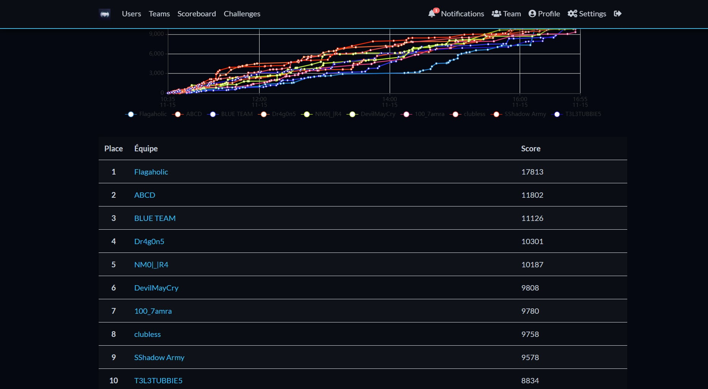
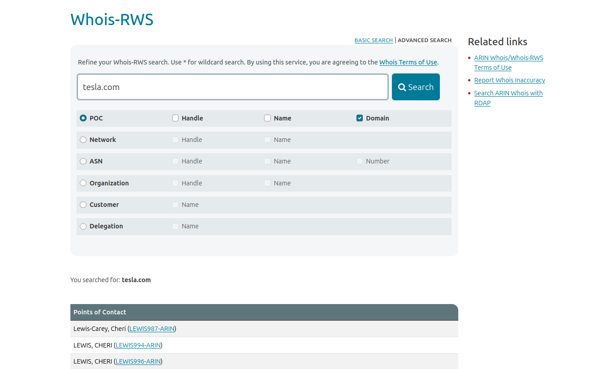
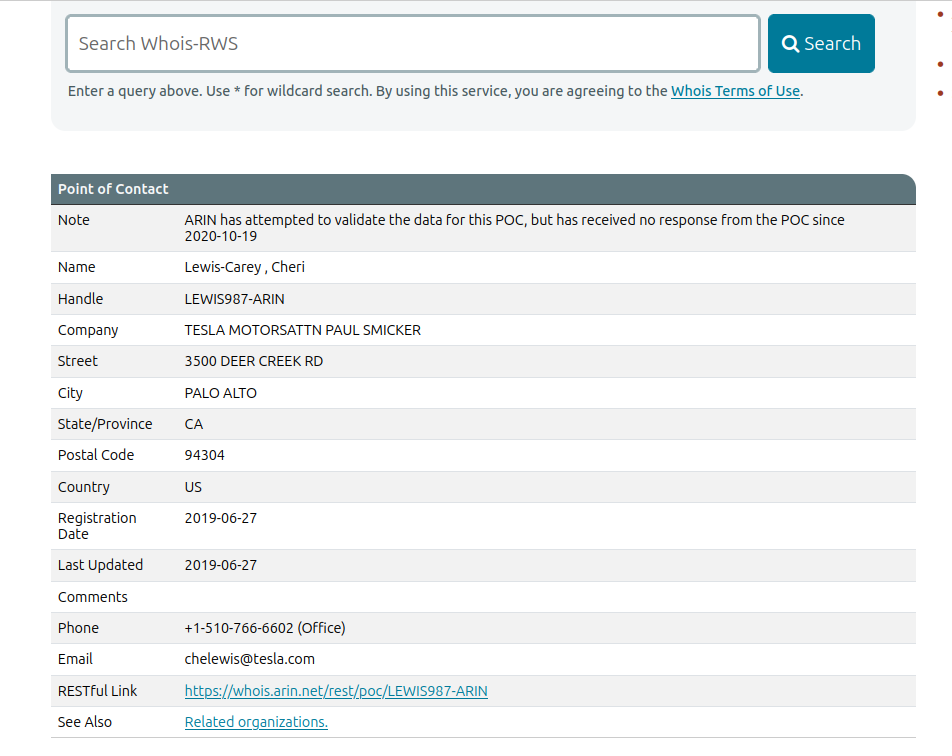
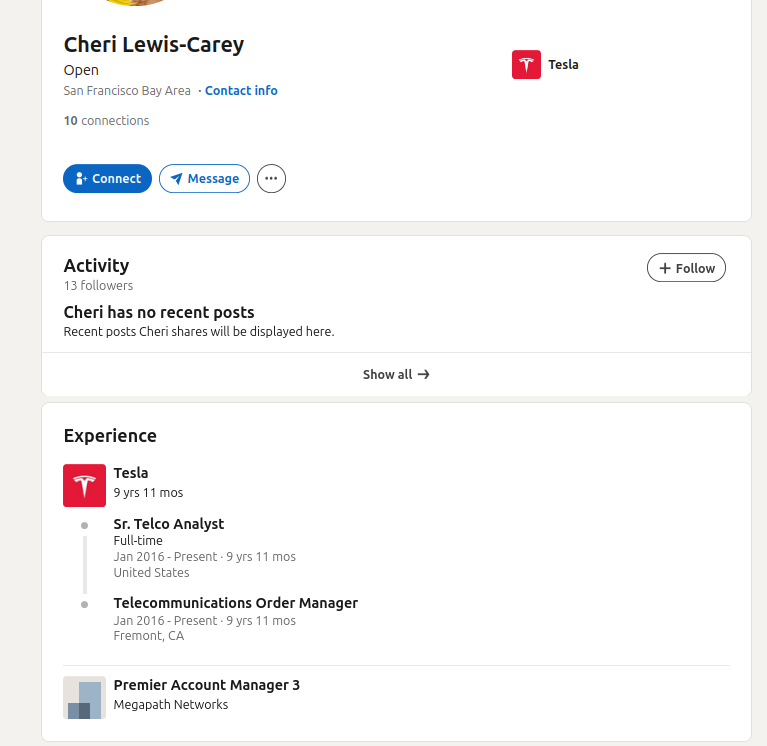

This is the writeup of the challenge  Revenge?

The challenge was solved by teammates Shelba and Odina. For a brief moment, the challenge was valued at 10,000 points, which allowed us to secure first place with a large margin, as we were the only team to solve it.

  

Thus the authors had to nerf us by reducing the pts to 1000 for being overpowered and  making the ctf more competetive as it is the CTF is meant to be beginner-friendly.

## Description:
    She refused the interview, and now my friend wants revenge — he’s trying to find her name and the company she worked for before Tesla; he only knows that she’s from California.
    Flag Format : Securinets{Firstname_Lastname_Company}  

So the goal is to find the identity of a woman known these hints :
 -from california 
 -worked for Tesla before
 -refused an interview

Following the AI recommendation we began our investigation using this [website](https://whois.arin.net/ui/advanced) and using to filter the domain to tesla.com

  

we find the reccuring of the name of the name LEWIS, CHERI which when redirecting to page we find 

  

verifing the place from california (CA).
 
A simple google search on the name gives out the [linkedin account of our targets](https://www.linkedin.com/in/cheri-lewis-carey-34485ab8/) wich shows their past experiences 

  

Hence getting the flag in its format Securinets{Cheri_Lewis-Carey_MegapathNetworks}